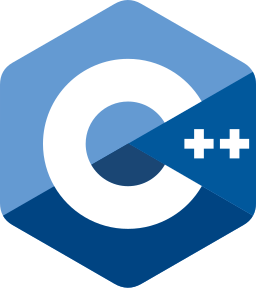

<h1 align="center">Hi  , I'm Harsh Gupta</h1>

## 💻 Tech Stack
<h3 align="left">Programming Languages:</h3>

<h3 align="left">Libraries and Frameworks:</h3>
 

<h3 align="left">Database:</h3>

<h3 align="left">Design/Visual Tools:</h3>

<h3 align="left">Backend:</h3>

<h3 align="left">Others:</h3>

<h2 align="center">👨‍💻 Top Repositories 👨‍💻</h2>
 

  
  

      
<h4 align="center">
  <a href="https://github.com/dudegladiator?tab=repositories" title="Show Repositories">🔎 Show More 🔍</a>
</h4>

##  Github Stats

 

## 
 Let's Connect..!

 

        
        
		
		
	
      

